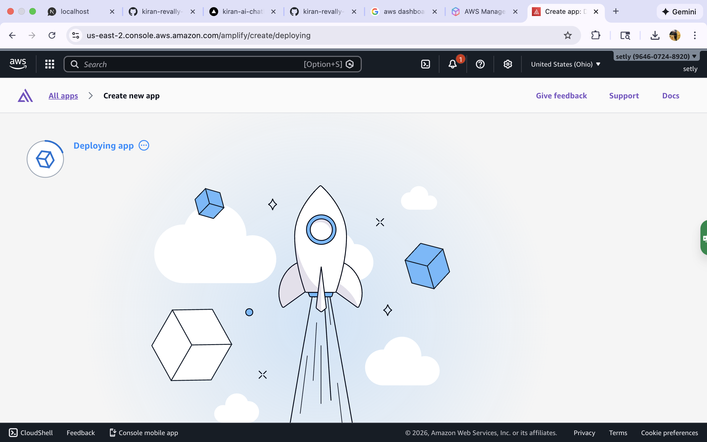
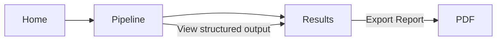

# Coco – Contract Risk Analyzer   .   

live @   https://main.d2f04gah5juytg.amplifyapp.com

> Turning messy contract text → structured risk report using an LLM + validation + retries + metrics.

This README is a slow-scrolling walkthrough so viewers can understand the product and engineering approach in 2–3 minutes.

---

## Quick Demo (Screenshots)

<table align="center">
	<tr>
			<td align="center">
			<br/>
			<em>Results dashboard with evidence and clause table.</em>
		</td>
	<td align="center">
			<br/>
			<em>Home: choose type/persona/model and analyze.</em>
		</td>
	
	</tr>
  
</table>

<p align="center">
	
	<br />
	<em>Diff View: Suggested redlines side-by-side with the original clause.</em>
</p>

<p align="center">
	
	<br />
	<em>Metrics & Export: Model, tokens, latency, retries, and PDF export.</em>
</p>

---

## User Flow (Home → Pipeline → Results)
- Home: Choose contract type/persona/model and paste or upload a file.
- Pipeline: Observability view of 8 steps and Model Run metrics.
- Results: Risk dashboard with evidence quotes, clause table, and PDF export.



---

## How the LLM Is Used

### API Call (OpenAI)
```ts
import { NextResponse } from 'next/server';
import { openai } from '@ai-sdk/openai';
import { generateObject } from 'ai';
import { ContractAnalysisSchema } from '@/lib/contract-analyzer/schemas';

export const runtime = 'nodejs';

export async function POST(request: Request) {
	const { contractText, modelId } = await request.json();
	const system = 'Structured extraction + explainability';
	const prompt = 'Analyze contract and return JSON matching schema';

	const result = await generateObject({
		model: openai(modelId),
		schema: ContractAnalysisSchema,
		system,
		prompt,
		temperature: 0.5,
	});

	return NextResponse.json({
		analysis: result.object,
		tokensUsed: {
			input: result.usage?.promptTokens || 0,
			output: result.usage?.completionTokens || 0,
		},
		modelUsed: modelId,
	});
}
```

### Prompt Strategy (excerpt)
```ts
export const productIntelligencePrompt = `
You are an AI-powered Contract Risk Analyzer.

Transform unstructured contract text into structured, explainable insights.
- Extract risky clauses
- Provide verbatim evidence quotes and locations
- Explain, suggest negotiation, and score risk
`;
```

### Schema Validation (Zod)
```ts
import { z } from 'zod';

export const ClauseSchema = z.object({
	title: z.string(),
	risk_level: z.enum(['low','medium','high']),
	evidence_quotes: z.array(z.object({ quote: z.string().min(15), location: z.string() })).min(1),
	plain_english: z.string(),
	negotiation_language: z.string(),
});

export const ContractAnalysisSchema = z.object({
	overall_risk_score: z.number().min(0).max(100),
	clauses: z.array(ClauseSchema).min(1),
	missing_protections: z.array(z.string()).default([]),
});
```

### Retries & Metrics
- Bounded retries on validation failures; rate-limit handling.
- Precise tokens via provider usage or tokenizer fallback (`@dqbd/tiktoken`).
- Latency, retries, and estimated cost tracked per model.


An AI-powered chatbot application designed to provide conversational assistance using modern web technologies and API-driven architecture. This project focuses on clean frontend integration, scalable backend communication, and practical AI usage patterns.

---

## 🚀 Overview

This project demonstrates the implementation of an AI chatbot with an emphasis on:
- Modular frontend architecture
- API-based AI integration
- Maintainable and extensible design
- Real-world usage patterns rather than experimental demos

The chatbot can be extended to support use cases such as customer support, internal tooling, knowledge assistants, or automation workflows.

---

## 🛠️ Tech Stack

**Frontend**
- TypeScript
- Modern JavaScript framework (React / Next.js)

**Backend & AI**
- Node.js
- REST APIs
- OpenAI / LLM-based integration

**Tooling**
- Git & GitHub
- Environment-based configuration
- Modular code structure

---

## ✨ Features

- Conversational AI interaction using LLM APIs
- Clean separation between UI and AI logic
- Reusable and extensible prompt handling
- API-based request/response flow
- Configurable environment setup for API keys
- Designed for scalability and future enhancements

### Contract Analyzer (Demo / Educational)

- Structured risk analysis for pasted contract text (ToS, NDA, SaaS, etc.)
- Evidence-backed findings with quoted snippets and locations
- Risk score, risk level, confidence, and most risky areas
- Clause table with pushback and suggested redlines
- Missing/weak clauses and questions to ask
- Metrics footer: model, tokens, latency, cost, retry count

---

## 📸 Showcase

These screenshots highlight the core experience:


<table align="center">
	<tr>
		<td align="center">
			<br/>
			<em>Home</em>
		</td>
		<td align="center">
			<br/>
			<em>Pipeline</em>
		</td>
	</tr>
	<tr>
		<td align="center">
			<br/>
			<em>Results</em>
		</td>
		<td align="center">
			<br/>
			<em>Diff View</em>
		</td>
	</tr>
	<tr>
		<td align="center" colspan="2">
			<br/>
			<em>Metrics & Export</em>
		</td>
	</tr>
</table>

Notes:
- Images live at `app/docs/showcase1.png` … `app/docs/showcase5.png` in this repo for GitHub rendering.

---

## 📐 Architecture Highlights

- Frontend communicates with backend services via REST APIs
- AI logic is abstracted to allow swapping or extending models
- Stateless request handling for scalability
- Clear separation of concerns for maintainability

### Tech Choices Rationale

- **Zod for Validation**: Ensures LLM outputs match strict schemas, catching invalid JSON and protecting downstream consumers. Mirrors enterprise schema enforcement used in regulated domains.
- **Retry + Backoff**: Auto-retry once or twice on invalid responses to reduce transient failures; standard production reliability pattern.
- **Evidence Requirement**: Every risk claim must include at least one quote from input, improving traceability and user trust.
- **Regex Guardrails**: Basic SSN/email/phone/profanity detection on the client to avoid sensitive data usage in demos.
- **generateObject**: Structured generation with schema guidance for consistency over free-text outputs.

---

## 🧪 Use Cases

- AI-powered customer support chatbot
- Internal productivity or knowledge assistant
- Proof-of-concept for AI-driven applications
- Foundation for integrating AI into larger platforms

---

## ⚙️ Getting Started

### Prerequisites
- Node.js (v18+ recommended)
- npm or yarn
- API key for the AI provider

### Installation & Run
```bash
# Clone
git clone git@github.com:kiran-revally-unh/kiran-ai-chatbot.git
cd kiran-ai-chatbot

# Install
npm install

# Env
export OPENAI_API_KEY=your_key_here

# Dev
npm run dev
# Open http://localhost:3000/contract-analyzer
```

### Example Flow
- Open Contract Analyzer from the sidebar
- Paste sample/public text or use Sample Loader
- Select contract type, jurisdiction, persona
- Click Analyze to get structured results with evidence and metrics

### Safety Note
This tool is educational and not legal advice. Use only sample or public contract text.

---

## Deploy (Vercel)

You can deploy with either the Vercel CLI or via GitHub import.

### Option A — CLI
```bash
# Install CLI
npm i -g vercel

# Login and initialize project
vercel login
vercel

# Set env vars
vercel env add OPENAI_API_KEY production
vercel env add OPENAI_API_KEY preview
vercel env add OPENAI_API_KEY development

# Optional DB (if you enable Postgres)
vercel env add POSTGRES_URL production

# Deploy
npm run deploy
# On success, Vercel prints your live URL
```

### Option B — GitHub Import
- Push this repo to GitHub
- Import the repo in Vercel dashboard
- Add OPENAI_API_KEY (and optional POSTGRES_URL) in Project Settings → Environment Variables
- Click Deploy; Vercel shows the live URL

Notes:
- API routes require Node runtime, enforced in app/api/contract/analyze/route.ts.
- Build script runs next build; DB migrations are not executed automatically on deploy.
